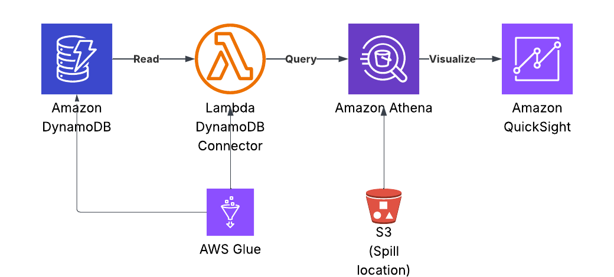
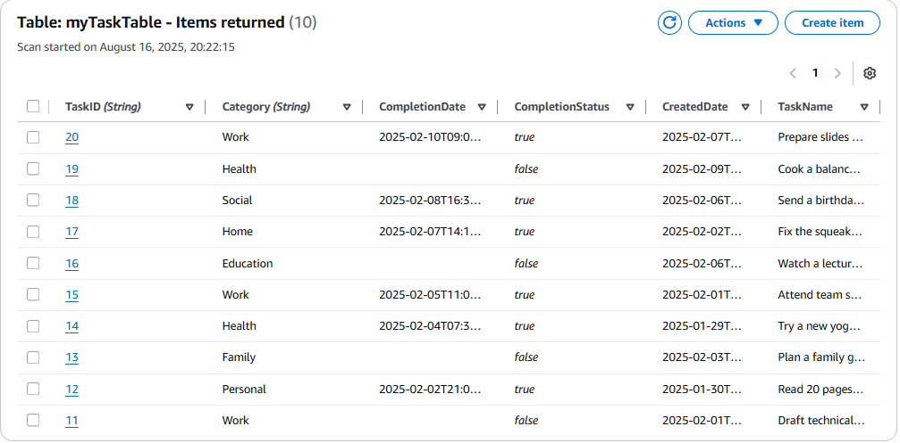
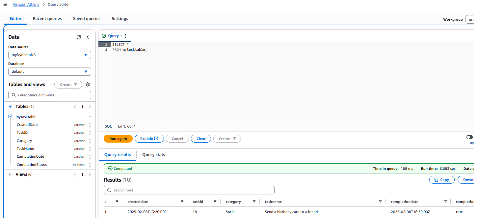
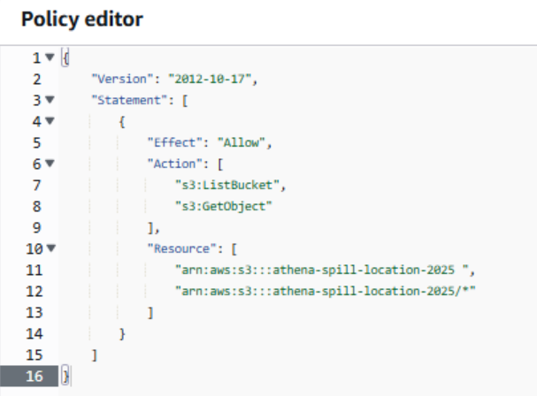
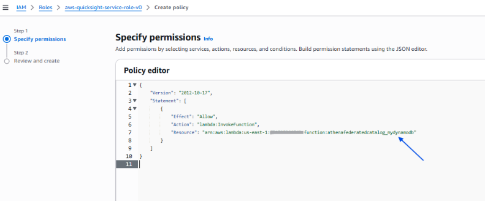
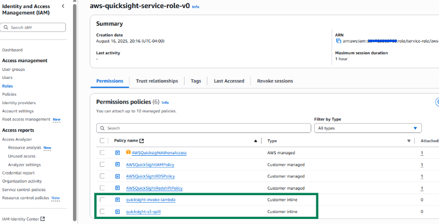
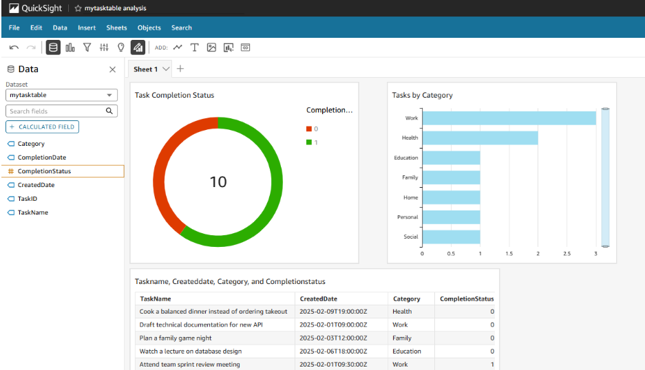
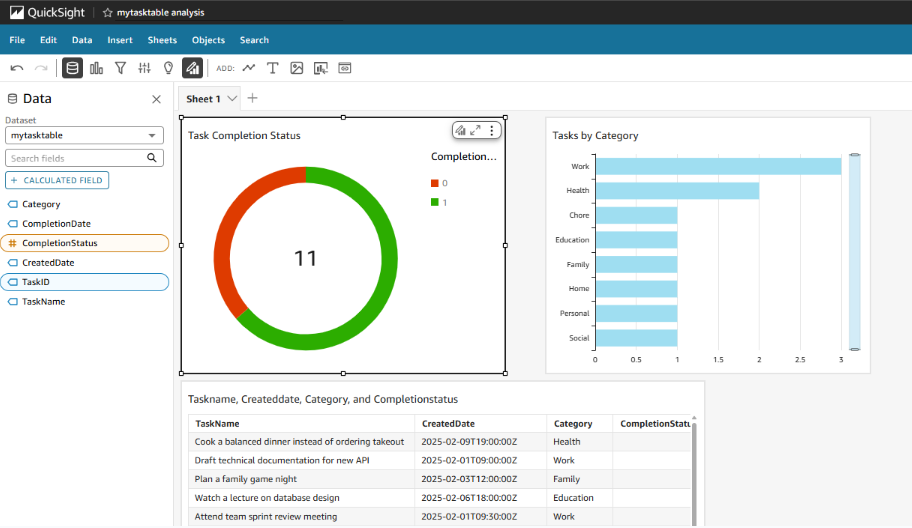

# Serverless Analytics with AWS DynamoDB, Athena, S3, Glue & QuickSight  

## 📖 Overview  

This project demonstrates how to build a **serverless end-to-end analytics pipeline** on AWS by connecting **DynamoDB** (NoSQL) data to **QuickSight dashboards** using **Athena** as the query layer, **Lambda** as the connector, and **S3** as the spill location. The project showcases how to integrate NoSQL and SQL worlds to enable real-time reporting without managing servers.  

---

## 🎯 Objective  

- Store task data in **DynamoDB**  
- Query the data using **Athena** via the **DynamoDB Lambda Connector**  
- Use **S3** as the spill bucket and Athena query result storage  
- Manage schema with **Glue Data Catalog**  
- Visualize insights in **QuickSight** dashboards  
- Configure **IAM roles and policies** for secure service-to-service communication  

---

## 🛠️ Technologies Used  

- **Amazon DynamoDB** – NoSQL data store  
- **AWS Lambda** – DynamoDB–Athena connector  
- **Amazon Athena** – Query engine (SQL layer)  
- **Amazon S3** – Spill location & query result storage  
- **AWS Glue Service** – Schema registry  (Grabs supplementary metadata like dynamoDB schema, format and properties)
- **AWS IAM** – Access control for Lambda, S3, QuickSight  
- **Amazon QuickSight** – Business intelligence & visualization  

---

## 🔄 Data Flow  

1. **DynamoDB** holds JSON items representing tasks.  
2. **Athena** queries DynamoDB using SQL via the **Lambda Connector**.  
3. The connector stores overflow data (blocks > 6 MB) in **S3**.  
4. **Glue Data Catalog** manages schema for Athena queries.  
5. **QuickSight** connects to Athena for data visualization.  
6. **IAM roles** ensure QuickSight has permission to invoke Lambda and access S3.  

📸 *Architecture Diagram*  
  

---

## 🗄️ DynamoDB Setup  

### Example JSON Item  

```json
{
  "TaskID": { "S": "1" },
  "Category": { "S": "Work" },
  "TaskName": { "S": "Craft the world's most persuasive client proposal" },
  "CompletionStatus": { "BOOL": true },
  "CompletionDate": { "S": "2025-01-15T17:00:00Z" },
  "CreatedDate": { "S": "2025-01-10T10:00:00Z" }
}

📸 *DynamoDB Table Screenshot*  
  

---

## ⚡ Lambda DynamoDB Connector  

- AWS provides a **pre-built Lambda function** for querying DynamoDB from Athena.  
- Configure the Lambda with:  
  - **S3 Spill Bucket** for large query results  
  - Appropriate **IAM Role** permissions  


---

## Athena Configuration  

- Create a new data source in Athena using the Lambda connector.  
- Define the **S3 output location** for query results.  
- Use SQL queries to retrieve and aggregate DynamoDB task data.  

*Athena Query Example*  
  

---

## IAM Role Configuration  

- **Inline policies** were added for QuickSight:  
  1. Permission to invoke the **Lambda DynamoDB Connector**  
  2. Access to the **S3 spill bucket**  

*IAM Role Screenshot*  
  
  
  
---

## QuickSight Dashboard  

- Connected QuickSight to Athena dataset.  
- Created charts for:  
  - Task completion status  
  - Category-wise breakdown  
  - Trends over time  

*QuickSight Dashboard*  
  

---

## Testing the Pipeline  

1. Add a new item in DynamoDB (e.g., change a task value).  
2. Run Athena query.  
3. Confirm that QuickSight dashboard reflects the update.  

*Update Reflected in Dashboard*  
  

---

## Future Improvements  

- **UI for DynamoDB**: Build a frontend to add/update tasks (instead of manual JSON insert).  
- **Real-time ingestion**: Stream updates via **Kinesis → S3 → QuickSight**.  
- **Enhanced error handling**: More granular IAM policies, better failure tracking.  
- **Infrastructure as Code**: Automate setup with **CloudFormation** or **Terraform**.  

---

## Why This Project Matters  

This project shows how to **bridge operational NoSQL data with analytical SQL queries** to deliver real-time business insights — a common challenge in data engineering & analytics teams. It’s fully **serverless**, cost-efficient, and production-ready.  

---
