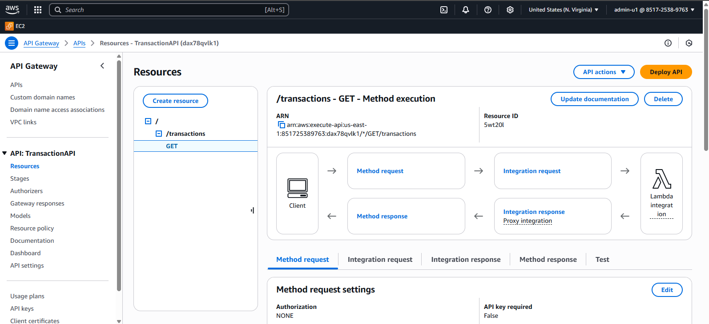
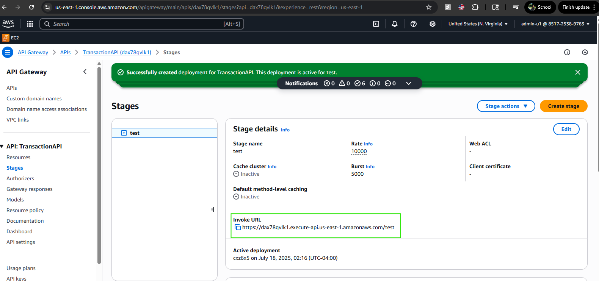
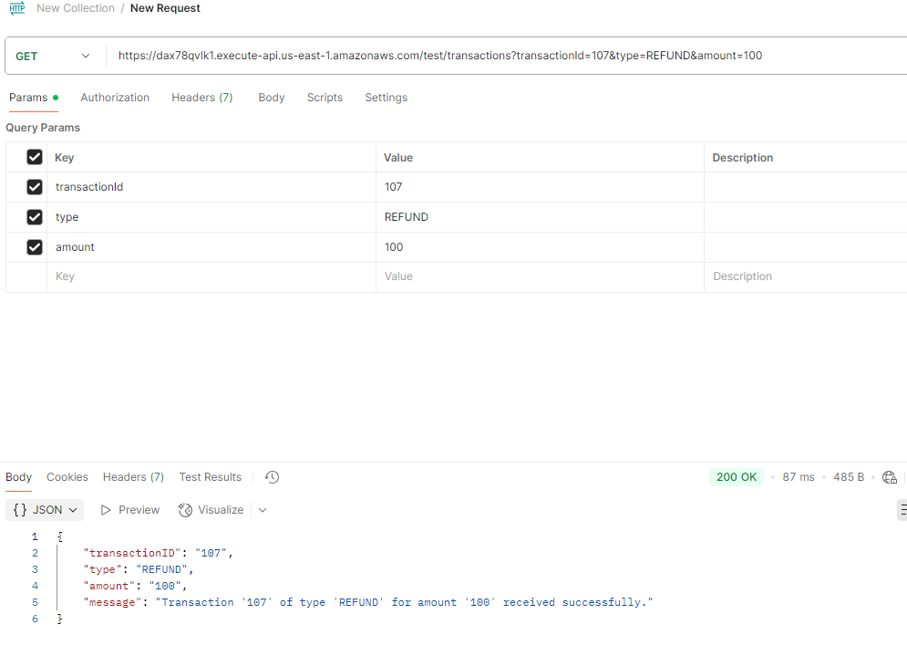
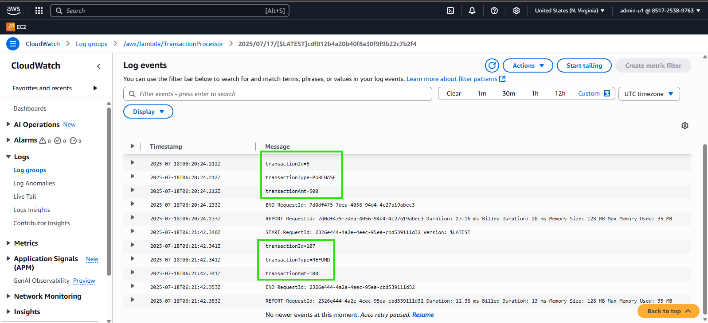

# Serverless REST API with AWS Lambda and API Gateway

## Overview

This project demonstrates how to build a RESTful API using AWS Lambda and API Gateway without provisioning or managing any servers (no EC2 instances). The API is designed to handle input through query parameters, invoke a Lambda function, and return a JSON response to the client.

## Objective

- Create a GET endpoint using API Gateway
- Invoke a Lambda function when the endpoint is called
- Return a structured JSON response containing the query parameters

## Technologies Used

- AWS Lambda
- Amazon API Gateway
- Amazon CloudWatch (for logging)
- (Optional) Postman for testing

## Input Parameters

The endpoint expects the following query string parameters:

- `transactionId` – Unique identifier for the transaction
- `transactionType` – Type of transaction
- `amount` – The transaction amount

## Lambda Function Behavior

1. Extracts the three query parameters from the request
2. Constructs a simple JSON object with the received values
3. Returns the JSON as the HTTP response, including appropriate headers

## Lambda Function

## API Gateway Setup

## Deploying the API

## How to Access and Test the API

### Using a Web Browser

- Deploy the API in API Gateway
- Get the full endpoint URL
- Append query parameters to the URL as follows: 
`https://<your-api-id>.execute-api.<region>.amazonaws.com/<stage>?transactionId=123&type=payment&amount=100`
- Open this URL in a browser to see the JSON response

### Result in Browser

### Using Postman

- Set the method to `GET`
- Paste the full endpoint URL
- Use the **Params** tab to input the three required parameters
- Click **Send** to view the response

### Result in Postman

## Verifying Logs

To confirm that the Lambda function executed successfully:

- Navigate to **CloudWatch Logs** in the AWS Management Console
- Find the log group associated with your Lambda function
- Open the latest log stream to view request data and any debug output

### Verifying CloudWatch Logs

## Future Improvements

The following enhancements are planned for future integration:

- **Input Validation**: Ensure all required parameters are provided. Return a `400 Bad Request` if any are missing.
- **Support for Additional HTTP Methods**: Add support for `POST` requests with JSON payloads.
- **DynamoDB Integration**: Store transaction records in a DynamoDB table for persistence.
- **Robust Error Handling**: Improve resilience by returning appropriate status codes and messages.
- **IAM Role Permissions**: Restrict the Lambda execution role to follow the principle of least privilege.
- **CORS Support**: Enable CORS headers for cross-origin requests from frontend clients and tools like Postman.
- **Automated Deployment**: Use tools like AWS SAM or Terraform to manage infrastructure as code.

